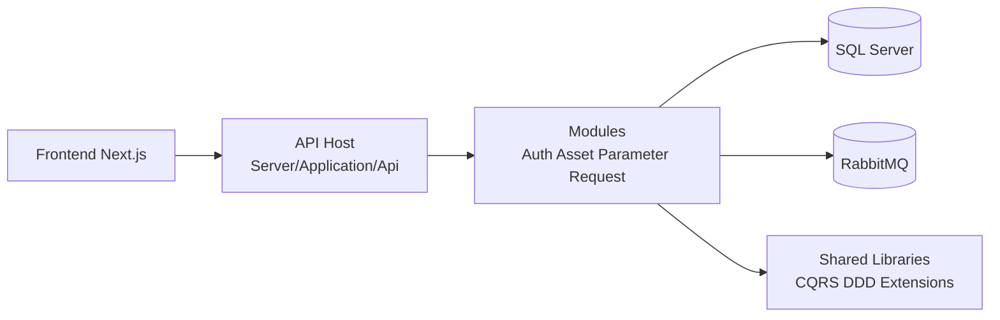
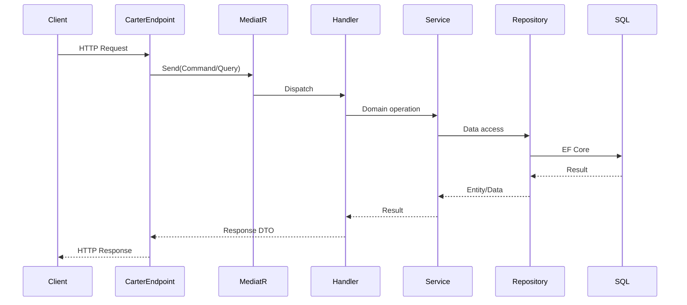

# CE-AMS (Computer Engineering Asset Management System)

Web application for department asset management with role-based workflows.

This repository contains:
- Backend: .NET 10 Modular Monolith (`Server`)
- Frontend: Next.js (`ClientApp`)
- Local infrastructure: SQL Server + RabbitMQ (`docker-compose.yml`)

## 1) Project Goal

The system targets paperless asset operations:
- Centralized asset data
- Request + approval workflows (borrow/repair/retire)
- Asset status tracking and history
- Notification-ready architecture via message broker

## 2) Current Implementation Status

Implemented now:
- Auth module (signup, login, logout)
- JWT token generation and JWT bearer authentication
- Session guard to block duplicate login within token lifetime
- SQL Server integration (EF Core)

Prepared but not fully implemented yet:
- Asset workflows
- Request workflows
- Notification consumers/processing flow
- `GET /auth/me`

## 3) Tech Stack

- .NET 10
- Carter (Minimal API modules)
- MediatR (v11)
- EF Core + SQL Server
- MassTransit + RabbitMQ (infrastructure prepared)
- Next.js 16 + React 19 + TypeScript
- Docker Compose for local dependencies

## 4) Architecture

### 4.1 High-Level Architecture



### 4.2 Backend Modular Monolith

```text
Server/
|-- Application/
|   |-- Api/                      # Composition root, middleware, auth setup
|-- Modules/
|   |-- Auth/                     # Auth domain + endpoints (implemented)
|   |-- Asset/                    # Asset domain (partial)
|   |-- Parameter/                # Parameter domain (partial)
|   |-- Request/                  # Request domain (scaffolded)
|-- Shared/
|   |-- Shared/                   # CQRS/DDD/EF common utilities
|   |-- Shared.Messaging/         # MassTransit shared messaging setup
```

### 4.3 Request Handling Pattern



### 4.4 Auth Flow (Current)


## 5) API Endpoints (Current)

Base URL (default local): `http://localhost:5176`

### 5.1 Sign Up

- Method: `POST`
- Path: `/auth/signup/user`
- Auth required: No

Request:
```json
{
  "username": "ctharawi",
  "email": "chinnaphon.trw@gmail.com",
  "password": "123a456X!@.",
  "roleCode": "00"
}
```

Response:
- `201 Created` with `{"userId":"<guid>"}`
- `400 Bad Request` with `{"message":"..."}` on validation/business error

### 5.2 Login

- Method: `POST`
- Path: `/auth/login`
- Auth required: No

Request:
```json
{
  "email": "chinnaphon.trw@gmail.com",
  "password": "123a456X!@."
}
```

Response:
- `200 OK`:
```json
{
  "accessToken": "<jwt>",
  "tokenType": "Bearer",
  "expiresIn": 900,
  "userId": "xxxxxxxx-xxxx-xxxx-xxxx-xxxxxxxxxxxx",
  "username": "ctharawi",
  "email": "chinnaphon.trw@gmail.com",
  "roleCode": "00",
  "roleName": "ADMIN"
}
```
- `400 Bad Request` when request payload is invalid
- `401 Unauthorized` when email/password is invalid
- `409 Conflict` when same user is already logged in (active session not expired)

### 5.3 Logout

- Method: `POST`
- Path: `/auth/logout`
- Auth required: Yes (Bearer token)

Request header:
```http
Authorization: Bearer <accessToken>
```

Response:
- `200 OK` with `{"message":"Logged out successfully."}`
- `401 Unauthorized` when token missing/invalid
- `404 Not Found` when user in token does not exist

## 6) Local Development Setup

### 6.1 Prerequisites

- .NET SDK 10
- Node.js 20+ (recommended LTS)
- Docker Desktop

### 6.2 Start Infrastructure

1. Ensure `.env` exists at repo root and contains:
- `DB_PASS`
- `RABBITMQ_USER`
- `RABBITMQ_PASS`

2. Start containers:

```powershell
docker compose up -d
```

Services:
- SQL Server: `localhost:1433`
- RabbitMQ AMQP: `localhost:5672`
- RabbitMQ UI: `http://localhost:15672`

### 6.3 Apply Database Migrations

If DB is empty, run migrations for each context:

```powershell
dotnet ef database update --project Server/Modules/Auth/Auth/Auth.csproj --startup-project Server/Application/Api/Api.csproj --context Auth.Data.AuthDbContext
dotnet ef database update --project Server/Modules/Asset/Asset/Asset.csproj --startup-project Server/Application/Api/Api.csproj --context Asset.Data.AssetDbContext
dotnet ef database update --project Server/Modules/Parameter/Parameter/Parameter.csproj --startup-project Server/Application/Api/Api.csproj --context Parameter.Data.ParameterDbContext
```

### 6.4 Seed Roles (Required for Sign Up/Login)

Use the script in:
- `Server/Modules/Auth/Auth/Data/CREATE.sql`

Uncomment role inserts and execute against `AssetManagementDb`.

### 6.5 Run Backend

```powershell
dotnet restore
dotnet build Server/Application/Api/Api.csproj
dotnet run --project Server/Application/Api/Api.csproj
```

Default launch URL:
- `http://localhost:5176`

### 6.6 Run Frontend

```powershell
cd ClientApp
npm install
npm run dev
```

Default frontend URL:
- `http://localhost:3000`

## 7) Configuration

Main files:
- `Server/Application/Api/appsettings.json`
- `Server/Application/Api/appsettings.Development.json`
- `.env`

Important JWT settings:
- `Jwt:Issuer`
- `Jwt:Audience`
- `Jwt:Key` (must be strong and secret in real deployment)
- `Jwt:AccessTokenMinutes`

## 8) Security Notes

- Auth now uses JWT Bearer tokens.
- Duplicate login is blocked via session fields on `auth.UserName`.
- Logout clears server-side session state.
- JWT token itself remains valid until expiration unless token revocation/blacklist is implemented.

## 9) Known Gaps / Next Steps

- Implement `GET /auth/me`
- Add role-based authorization policies per endpoint
- Add rate limiting (global + login-specific)
- Complete Asset/Request/Notification module workflows
- Add refresh token and token revocation strategy for production-grade auth


# ClientApp (Next.js Frontend)

For full project onboarding and architecture, read the root documentation first:
- `../README.md`

## Run Locally

```bash
npm install
npm run dev
```

App URL:
- `http://localhost:3000`

## Scripts

- `npm run dev` start dev server
- `npm run build` production build
- `npm run start` run production server
- `npm run lint` run lint checks

