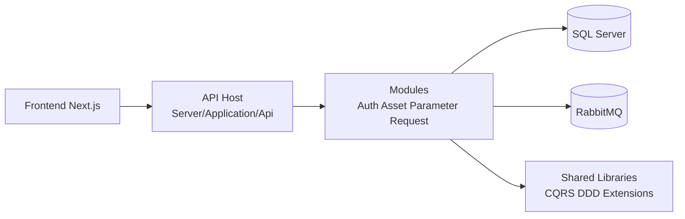
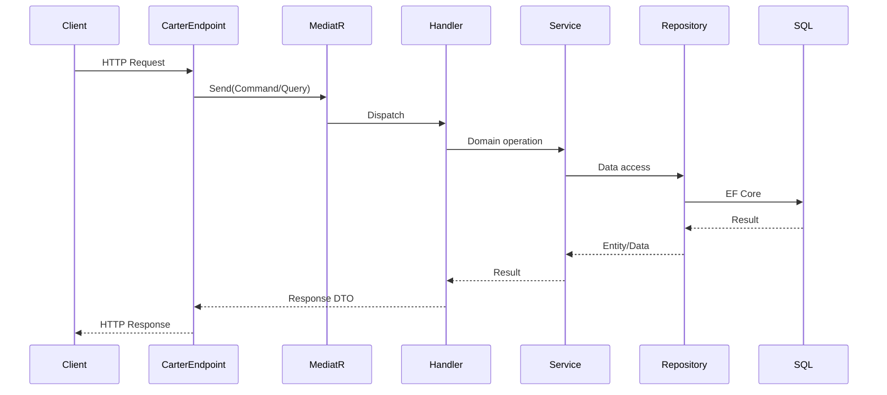
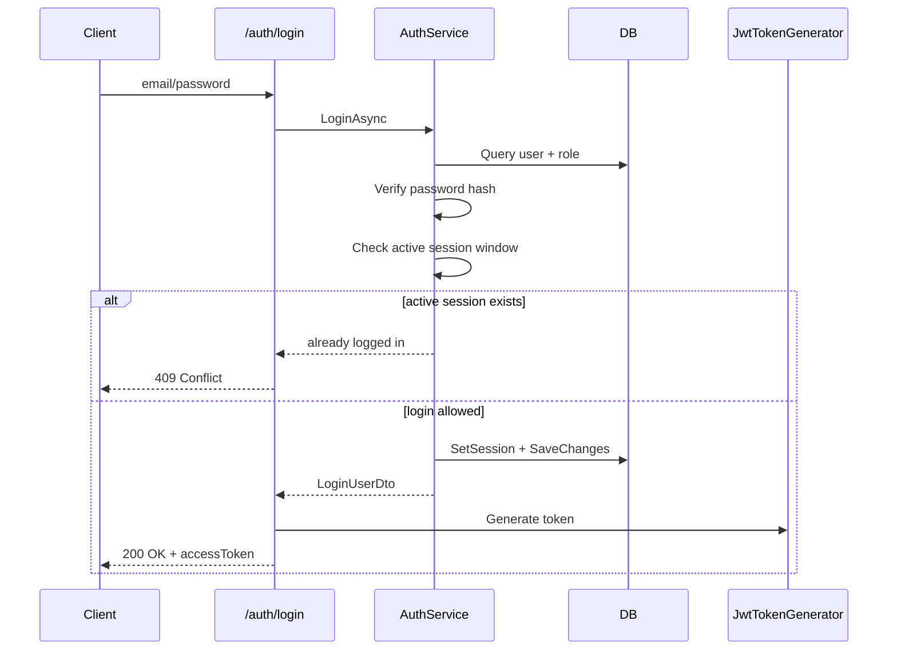

# CE-AMS (Computer Engineering Asset Management System)

Web application for department asset management with role-based workflows.

This repository contains:
- Backend: .NET 10 modular monolith (`Server`)
- Frontend: Next.js (`ClientApp`)
- Local infrastructure: SQL Server + RabbitMQ (`docker-compose.yml`)

## 1) Project Goal

The system targets paperless asset operations:
- Centralized asset data
- Request + approval workflows (borrow/repair/retire)
- Asset status tracking and history
- Notification-ready architecture via message broker

## 2) Current Implementation Status

Implemented now:
- Auth module with API endpoints: signup, login, logout
- JWT token generation + JWT bearer authentication
- Duplicate login guard (blocks active concurrent session inside token lifetime)
- SQL Server integration with EF Core migrations for Auth/Asset/Parameter/Request contexts

Partially implemented:
- Asset domain model + migrations
- Parameter domain model + migrations
- Request domain model + migrations
- RabbitMQ infrastructure wiring (consumers/workflows not complete)

Not implemented yet:
- Auth `GET /auth/me`
- Full Asset/Request API workflows
- Refresh token and token revocation strategy
- Fine-grained authorization policies per endpoint
- Updated approval loop when HOD rejects and request must return to lab teacher for reconciliation

Important current frontend note:
- `ClientApp` still uses mock auth data (`localStorage` + mock users) and is not wired to backend auth endpoints yet.

## 3) Tech Stack

- .NET 10 (`net10.0`)
- Carter (minimal API modules)
- MediatR
- EF Core + SQL Server
- MassTransit + RabbitMQ
- Next.js 16 + React 19 + TypeScript
- Docker Compose

## 4) Architecture

### 4.1 High-Level



### 4.2 Backend Layout

```text
Server/
|-- Application/
|   |-- Api/                      # Composition root, middleware, auth setup
|-- Modules/
|   |-- Auth/                     # Implemented API endpoints
|   |-- Asset/                    # Domain + migrations (no public API yet)
|   |-- Parameter/                # Domain + migrations (no public API yet)
|   |-- Request/                  # Domain + migrations (no public API yet)
|-- Shared/
|   |-- Shared/                   # CQRS/DDD/EF common utilities
|   |-- Shared.Messaging/         # MassTransit shared setup
```

### 4.3 Request Handling Pattern



### 4.4 Auth Flow (Current)



### 4.5 Asset Schema Snapshot (from current migration)

Current main tables in schema `asset`:
- `Laboratories`
- `Assets`
- `AssetUnits`
- `AssetUnitConditions`
- `AssetUnitHistories`
- `OutboxMessages`

Core relationships:
- `Laboratories (1) -> (many) Assets`
- `Assets (1) -> (many) AssetUnits`
- `AssetUnits (1) -> (0..1) AssetUnitConditions`
- `AssetUnits (1) -> (many) AssetUnitHistories`

### 4.6 Request Approval Policy (Updated)

New business rule:
- Every request must end with final approval decision by `HOD`.

Primary flow for student request:
1. Student submits request.
2. Request goes to lab teacher first.
3. Lab teacher must assign specific asset unit(s) or approved quantity, then approve/reject.
4. If teacher approves, request is forwarded to HOD.
5. HOD gives final approve/reject.
6. If HOD rejects, request returns to lab teacher for reconciliation:
   - close as rejected, or
   - adjust assignment and resubmit to HOD.

Special case:
- If requester is the lab teacher, teacher step may be skipped and request starts at HOD.

Recommended implementation approach:
- Use a Request aggregate state machine plus `RequestTracking` step transitions.
- Do not use Saga for core approval routing in the current modular-monolith scope.
- Consider Saga/Process Manager only when cross-module asynchronous compensation is required.

## 5) API Endpoints (Current)

Base URL (local default):
- `http://localhost:5176`
- `https://localhost:7158`

Currently exposed HTTP endpoints are Auth endpoints only:

### 5.1 Sign Up

- Method: `POST`
- Path: `/auth/signup/user`
- Auth required: No

Request:
```json
{
  "username": "ctharawi",
  "email": "chinnaphon.trw@gmail.com",
  "password": "123a456X!@.",
  "roleCode": "00"
}
```

Response:
- `201 Created` with `{"userId":"<guid>"}`
- `400 Bad Request` with `{"message":"..."}` on validation/business error

### 5.2 Login

- Method: `POST`
- Path: `/auth/login`
- Auth required: No

Request:
```json
{
  "email": "chinnaphon.trw@gmail.com",
  "password": "123a456X!@."
}
```

Response:
- `200 OK`:
```json
{
  "accessToken": "<jwt>",
  "tokenType": "Bearer",
  "expiresIn": 900,
  "userId": "xxxxxxxx-xxxx-xxxx-xxxx-xxxxxxxxxxxx",
  "username": "ctharawi",
  "email": "chinnaphon.trw@gmail.com",
  "roleCode": "00",
  "roleName": "ADMIN"
}
```
- `400 Bad Request` when payload is invalid
- `401 Unauthorized` when email/password is invalid
- `409 Conflict` when user is already logged in (active session not expired)

### 5.3 Logout

- Method: `POST`
- Path: `/auth/logout`
- Auth required: Yes (Bearer token)

Request header:
```http
Authorization: Bearer <accessToken>
```

Response:
- `200 OK` with `{"message":"Logged out successfully."}`
- `401 Unauthorized` when token is missing/invalid
- `404 Not Found` when user from token does not exist

## 6) Local Development Setup

### 6.1 Prerequisites

- .NET SDK 10
- Node.js 20+ (LTS recommended)
- Docker Desktop

### 6.2 Start Infrastructure

1. Ensure `.env` exists at repo root and contains:
- `DB_PASS`
- `RABBITMQ_USER`
- `RABBITMQ_PASS`

2. Start containers:

```powershell
docker compose up -d
```

Services:
- SQL Server: `localhost:1433`
- RabbitMQ AMQP: `localhost:5672`
- RabbitMQ UI: `http://localhost:15672`

### 6.3 Apply Database Migrations

Option A: run per context directly:

```powershell
dotnet ef database update --project Server/Modules/Auth/Auth/Auth.csproj --startup-project Server/Application/Api/Api.csproj --context Auth.Data.AuthDbContext
dotnet ef database update --project Server/Modules/Asset/Asset/Asset.csproj --startup-project Server/Application/Api/Api.csproj --context Asset.Data.AssetDbContext
dotnet ef database update --project Server/Modules/Parameter/Parameter/Parameter.csproj --startup-project Server/Application/Api/Api.csproj --context Parameter.Data.ParameterDbContext
dotnet ef database update --project Server/Modules/Request/Request/Request.csproj --startup-project Server/Application/Api/Api.csproj --context Request.Data.RequestDbContext
```

Option B: use helper script:

```powershell
.\scripts\ef-migrations.ps1 -Action update -Context all
```

### 6.4 Seed Roles (Required for Sign Up/Login)

There is currently no checked-in `CREATE.sql` seed file in `Server/Modules/Auth/Auth/Data/`.

Insert required roles manually (example):

```sql
INSERT INTO auth.UserRole (RoleCode, RoleName, RoleDescription)
VALUES
('00', 'ADMIN', 'System administrator'),
('01', 'DEPTHEAD', 'Department head'),
('02', 'LECTURER', 'Lecturer'),
('03', 'STUDENT', 'Student');
```

Adjust role codes/names to match your business rules.

### 6.5 Run Backend

```powershell
dotnet restore
dotnet build Server/Application/Api/Api.csproj
dotnet run --project Server/Application/Api/Api.csproj
```

Default launch URLs:
- `http://localhost:5176`
- `https://localhost:7158`

### 6.6 Run Frontend

```powershell
cd ClientApp
npm install
npm run dev
```

Default frontend URL:
- `http://localhost:3000`

## 7) Frontend-Backend Auth Integration Notes

CORS is now configured in backend with policy `Frontend` and is enabled via `app.UseCors("Frontend")`.

Current development origins:
- `http://localhost:3000`
- `http://127.0.0.1:3000`

`appsettings.Development.json` example:

```json
{
  "Cors": {
    "AllowedOrigins": [
      "http://localhost:3000",
      "http://127.0.0.1:3000"
    ]
  }
}
```

Frontend integration checklist:
- Replace mock login in `ClientApp/app/contexts/AuthContext.tsx` with API call to `/auth/login`.
- Use `email/password` for login payload.
- Persist `accessToken` and send `Authorization: Bearer <token>` to protected endpoints like `/auth/logout`.
- Map backend `roleCode`/`roleName` to frontend role model.

## 8) Configuration

Main files:
- `Server/Application/Api/appsettings.json`
- `Server/Application/Api/appsettings.Development.json`
- `Server/Application/Api/Properties/launchSettings.json`
- `.env`

Important JWT settings:
- `Jwt:Issuer`
- `Jwt:Audience`
- `Jwt:Key` (must be strong and secret in production)
- `Jwt:AccessTokenMinutes`

## 9) Security Notes

- Auth uses JWT bearer tokens.
- Duplicate login is blocked using `Session` and `SessionActiveOn` fields in `auth.UserName`.
- Logout clears server-side session state.
- Access tokens remain valid until expiration unless revocation/blacklist is added.

## 10) Known Gaps / Next Steps

- Implement `GET /auth/me`
- Add role-based authorization policies per endpoint
- Add rate limiting (global and login-specific)
- Complete Asset/Request/Notification workflows
- Add refresh token and token revocation strategy for production-grade auth

## 11) Frontend README

Frontend-specific quick notes are also available at:
- `ClientApp/README.md`

